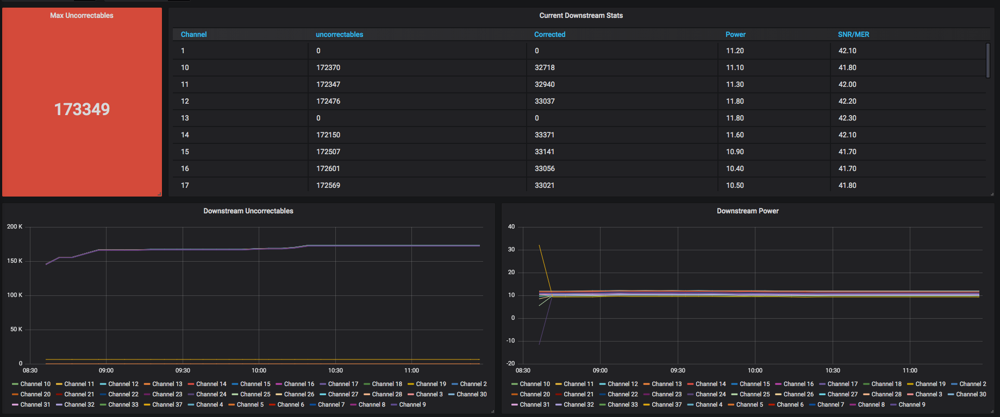
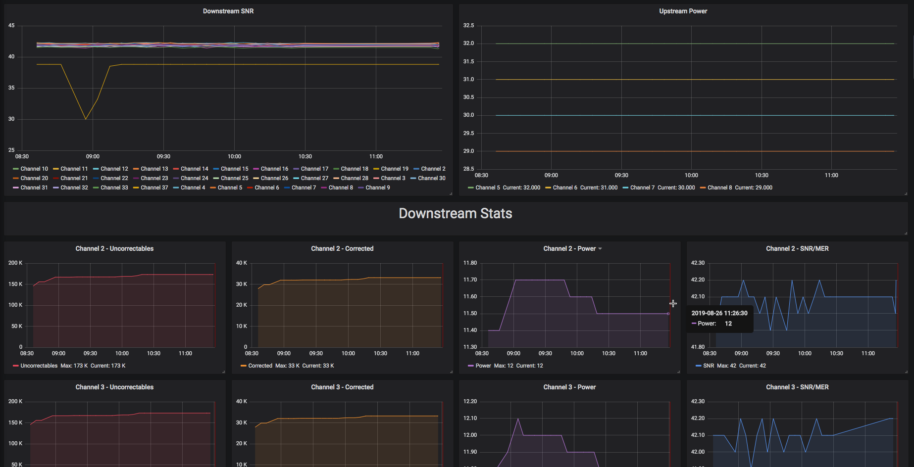
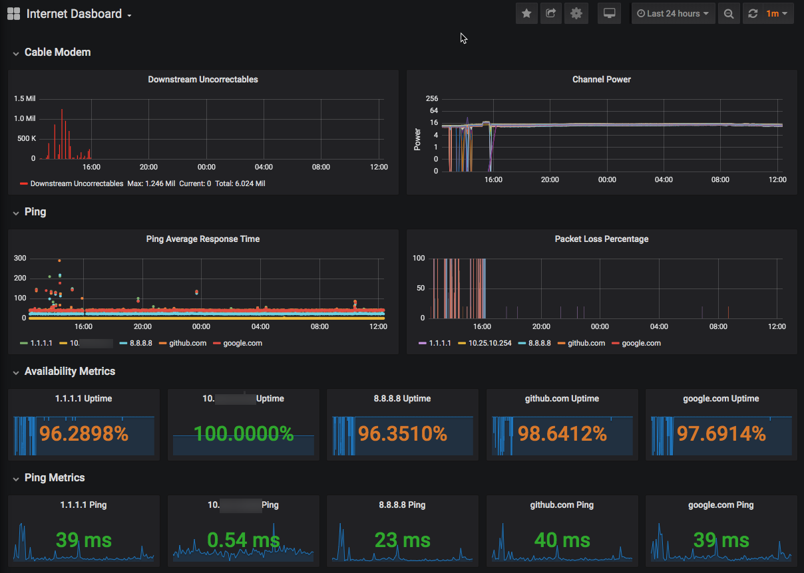

# arris_cable_modem_stats

This is a Python script to scrape stats from the Arris cable modem web interface.  Results are meant to be sent to InfluxDB for use with Grafana, but also currently supports AWS Timestream and Splunk.  This orginally started as a fork of https://github.com/billimek/SB6183-stats-for-influxdb

## Project EOL

I no longer have cable internet, thus cannot develop this project any further.  I will merge reasonable PRs that come in, but I will have no way to test the changes.

## Modems Supported

- SB8200
- SB6183
- T25

## Authentication
In late Oct 2020, Comcast deployed firmware updates to the SB8200 which now require authenticating against the modem.  If your modem requires authentication (you get a login page when browsing to https://192.168.100.1/), then you must edit your config.ini file (or set the matching ENV variables) and set ```modem_auth_required``` to ```True```, and set ```modem_password``` appropriately.  By default, your modem's password is the last eight characters of the serial number, located on a sticker on the bottom of the modem.

In October of 2021, Comcast again deployed new firmware that changed how authentication is handled.  The old login method is no longer supported, but if you are with a different carrier and still need the old login functionality, use release v1.2.0.  I have no way to test the old auth scheme, which is why it's no longer supported.

## InfluxDB 1.x vs 2.x
This supports both InfluxDB 1.x and InfluxDB 2.x.  See the Config Settings section below for options.  With InfluxDB 1.x, ```influx_host``` is the only required setting if your Influx server does not require authentication.  It will attempt to create the database if it doesn't exist.  For InfluxDB 2.x, change ```influx_major_version``` to ```2```, and also supply your url, org, bucket, and token with write access with the appropriate settings outlined below.

## Run with Docker

### From DockerHub
See other environment variables in Config Settings.  This image is automatically rebuilt every month.

    docker pull afraley/arris_cable_modem_stats
    docker run \
    -e modem_auth_required=True \
    -e modem_password='last eight characters of the serial number' \
    -e influx_host='influxhost.local' \
    --restart unless-stopped \
    afraley/arris_cable_modem_stats

### Build it yourself

Run in a Docker container with the following (see other environment variables in Config Settings):

    docker build -t arris_stats .
    docker run \
    -e modem_auth_required=True \
    -e modem_password='last eight characters of the serial number' \
    -e influx_host='influxhost.local' \
    --restart unless-stopped \
    arris_stats

## Run Locally

- Install Python 3.8.x or later
- Clone repo and
    - ```$ cd arris_cable_modem_stats/src```

- Install virtualenv
    - ```$ python3 -m pip install virtualenv```
- Create and activate virtualenv
    - ```$ python3 -m venv venv```
    - ```$ source venv/bin/activate```
- Install pip dependencies
    - ```python3 -m pip install -r requirements.txt```
- Edit config.ini and change influx_host to your influxdb server
- If your cable modem requires authentication, edit config.ini and set:
    - ```modem_auth_required = True```
    - ```modem_password = last_8_chars_of_modem_serial```
- Run arris_stats.py
    - ```python3 arris_stats.py --config config.ini```

## Config Settings
Config settings can be provided by the config.ini file, or set as ENV variables.  If you run arris_stats.py with --config config.ini, ENV settings will be ignored.

- ```log_level = debug|info|warning|error```
    - Valid options include:
      - ```debug```
      - ```info``` the default
      - ```warning```
      - ```error```
- ```destination = influxdb```
    - Valid options include:
      - ```influxdb``` requires all influx_* params to be populated
      - ```timestream``` requires all timestream_* params to be populated
      - ```splunk``` requires all splunk_* params to be populated
      - ```stdout_json``` will send the data to standard output in JSON format, great with ```log_level=error``` to suppress messages
- ```sleep_interval = 300```
- ```modem_url = https://192.168.100.1/cmconnectionstatus.html```
    - url for sb6183 = ```http://192.168.100.1/RgConnect.asp```
- ```modem_verify_ssl = False```
- ```modem_auth_required = False```
- ```modem_username = admin```
- ```modem_password = None```
- ```modem_model = sb8200```
    - models supported: ```sb6183```, ```sb8200```, ```t25```
- ```exit_on_auth_error = True```
    - Any auth error will cause an exit, useful when running in a Docker container to get a new session
- ```exit_on_html_error = True```
    - Any error retrieving the html will cause an exit, mostly redundant with exit_on_auth_error
- ```clear_auth_token_on_html_error = True```
    - This is useful if you don't want to exit, but do want to get a new session if/when getting the stats fails
- ```sleep_before_exit = True```
    - If you want to sleep before exiting on errors, useful for Docker container when you have restart = always
- Influx Settings
    - Global Influx settings
        - ```influx_major_version = 1``` Influx major version 1.x or 2.x
        - ```influx_verify_ssl = True```
    - Influx 1.x Settings
        - ```influx_host = localhost```
        - ```influx_port = 8086```
        - ```influx_database = cable_modem_stats``` This will be created automatically if it can
        - ```influx_username = None```
        - ```influx_password = None```
        - ```influx_use_ssl = False```
    - Influx 2.x Settings (All settings are required)
        - ```influx_org = None```
        - ```influx_url = http://influx.localdomain:8086```
        - ```influx_bucket = cable_modem_stats```  Must already exist, token must have write access
        - ```influx_token = None```


- AWS Timestream Settings
    - ```timestream_aws_access_key_id = None```
    - ```timestream_aws_secret_access_key = None```
    - ```timestream_database = cable_modem_stats```
    - ```timestream_table = cable_modem_stats```
    - ```timestream_aws_region = us-east-1```
- Splunk Settings
    - ```splunk_host = None```
    - ```splunk_port = 8088```
    - ```splunk_token = None```
    - ```splunk_ssl = False```
    - ```splunk_verify_ssl = True```
    - ```splunk_source = arris_cable_modem_stats```


### Debugging

You can enable debug logs in three ways:

1. Use --debug when running from cli
    - ```python3 arris_stats.py --debug --config config.ini```
2. Set ENV variable ```log_level = debug```
3. Set config.ini ```log_level = debug```

## Database Options

### InfluxDB
The database will be created automatically if the user has permissions (defaults to anonymous access).  See Config Settings above for a list of ENV variables (or config.ini options).

### AWS Timestream
Database and table are required to be created ahead of time using appropriate settings for your use-case. See Config Settings above for a list of ENV variables (or config.ini options).

### Splunk
Basic support for sending stats to Splunk is available.  Stats are sent as _json data to the Splunk HTTP Event Collector.  To setup Splunk:

- Go Settings->Data Inputs and click *HTTP Event Collector*.
- Click *Global Settings* on the top right and set All Tokens to Enabled.
- Optionally enable/disable SSL (set our splunk_ssl and splunk_verify_ssl variables accordingly)
- Click save and then click *New Token* on the top right.
- Give the token a name, all other defaults are ok, click next
- Set the default index to an index of your choosing, ensure the index is added to the Allowed Indexes list.
- Click Review then Submit, set our splunk_token ENV or config.ini value to the new token value.
- Update ENV or config.ini values for the splunk_ settings, and set ```destination = splunk```

## Grafana
There are two Grafana examples.  The first only relies on the Python script from this repo, while the second relies on [Telegraf](https://www.influxdata.com/time-series-platform/telegraf/).

### SB8200 Dashboard

- Setup arrris_stats.py to run from somewhere (There's a Docker example below)
- Import a new dashboard using the [grafana/sb8200_grafana.json](grafana/sb8200_grafana.json) file.  Originally exported from Grafana v6.3.3




### Internet Uptime Dashboard

- Install [Telegraf](https://www.influxdata.com/time-series-platform/telegraf/) on your InfluxDB system (or on a separate server/container)
- Drop [influxdb/telegraph_internet_uptime.conf](influxdb/telegraph_internet_uptime.conf) into ```/etc/telegraf/telegraf.d/```  (customize IPs/hosts to your liking)
- Restart/reload Telegraf
- Import [grafana/internet_uptime.json](grafana/internet_uptime.json) into Grafana


